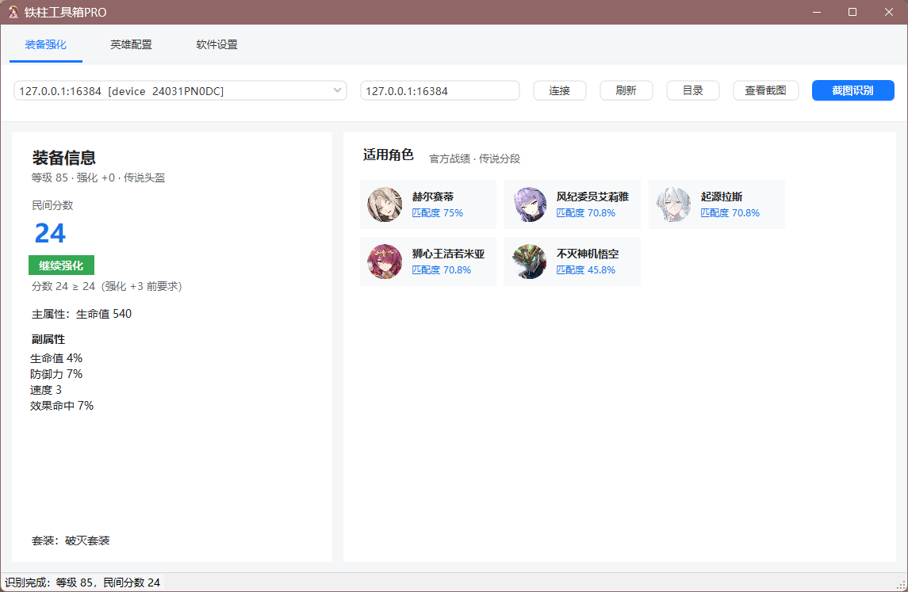
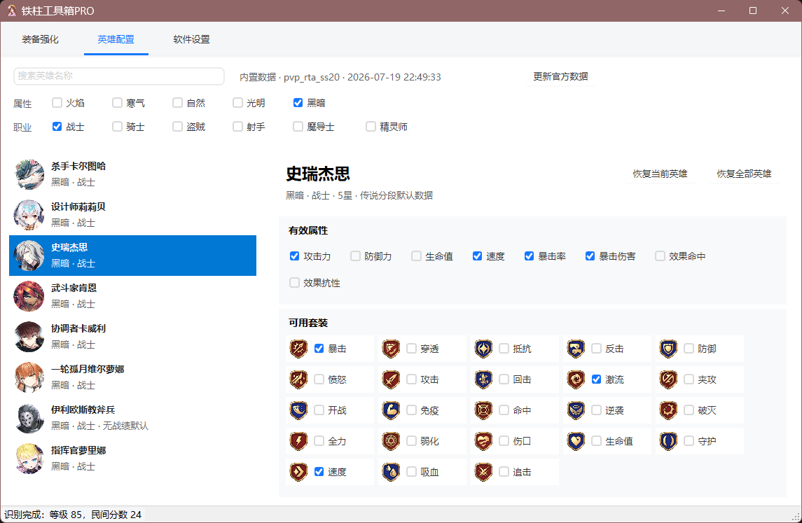
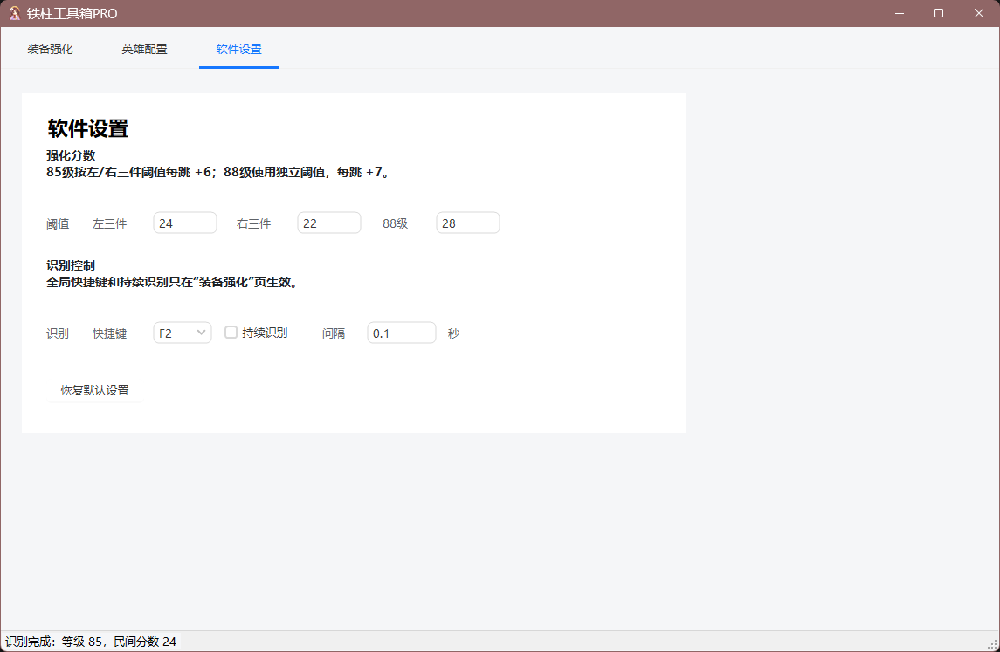

# 铁柱工具箱PRO

一款面向《第七史诗》的 Windows 装备强化辅助工具。通过 ADB 连接安卓模拟器并截取游戏画面，使用本地 OCR 自动识别装备信息、计算民间分数、给出强化建议，并结合官方传说分段数据推荐适用角色。

[下载最新版](https://github.com/Mooooooon/TiezhuToolboxPRO/releases/latest)

## 主要功能

- 自动识别装备等级、强化等级、品质、主属性、副属性和套装
- 根据副属性计算民间分数，并按装备等级和强化阶段给出强化建议
- 结合官方传说分段数据，按装备属性与套装推荐适用角色
- 支持编辑每位英雄的有效属性、可用套装和右三件主属性
- 支持自定义强化阈值、识别快捷键、持续识别和识别间隔
- 内置精简版 ADB，无需额外安装 .NET 运行环境

## 界面预览

### 装备强化

连接模拟器后，可一键截图识别装备，并查看分数、强化建议和适用角色。



### 英雄配置

可按名称、属性和职业筛选英雄，并调整有效属性、套装及右三件主属性规则。



### 软件设置

可调整装备分数阈值、全局识别快捷键和持续识别间隔。



## 使用方法

1. 从 [Releases](https://github.com/Mooooooon/TiezhuToolboxPRO/releases/latest) 下载最新版 ZIP 并完整解压。
2. 在安卓模拟器中开启 ADB 调试。MuMu 12 的默认地址为 `127.0.0.1:16384`。
3. 启动 `铁柱工具箱PRO.exe`，选择已发现的设备；如果没有发现设备，输入 ADB 地址后点击“连接”。
4. 在游戏中进入需要分析的装备的强化页面，然后点击“截图识别”或按默认快捷键 `F2`。
5. 在“装备强化”页查看装备分数、强化建议和适用角色。

## 使用要求

- Windows 10/11 64 位系统
- 支持 ADB 的安卓设备或模拟器
- 游戏使用简体中文界面
- 更新官方英雄数据时需要网络连接

## 识别说明

- OCR 在本机运行，识别效果会受到游戏分辨率、界面缩放和截图清晰度影响。
- 当前强化建议主要针对 85 级和 88 级装备，并分别使用独立阈值。
- 角色推荐以装备主属性和主流套装为硬性条件，再按有效副属性分数计算匹配度。
- 推荐结果仅供配装和强化决策参考，具体取舍仍应结合账号阵容。

## 装备强化判断免责声明

- 本工具提供的装备分数、强化建议和角色推荐基于民间算法、统计数据及用户设置的阈值，并非《第七史诗》官方结论，仅供参考。
- OCR 识别结果可能受到游戏版本、分辨率、界面缩放和画面质量等因素影响，请在强化前自行核对装备数据。
- 装备强化结果具有随机性，本工具无法保证实际强化结果或装备收益。因使用本工具建议而产生的游戏资源消耗、装备损失或其他后果，由使用者自行承担。

## 从源码构建

需要安装 [.NET 9 SDK](https://dotnet.microsoft.com/download/dotnet/9.0)。

```powershell
dotnet build src/TiezhuToolbox/TiezhuToolbox.csproj
dotnet publish src/TiezhuToolbox -c Release
```

## 免费软件声明

本软件为免费软件，作者及官方发布渠道不会收取任何软件购买费或授权费。请仅通过本项目的 [GitHub Releases](https://github.com/Mooooooon/TiezhuToolboxPRO/releases/latest) 获取正式版本。

如果您在任何平台或渠道为获取本软件本体支付了费用，该收费并非本项目官方行为，请及时联系卖家或付款平台申请退款，并注意防范第三方修改、捆绑或植入恶意程序的版本。

## 开源许可

本项目采用 [MIT License](LICENSE) 开源。
