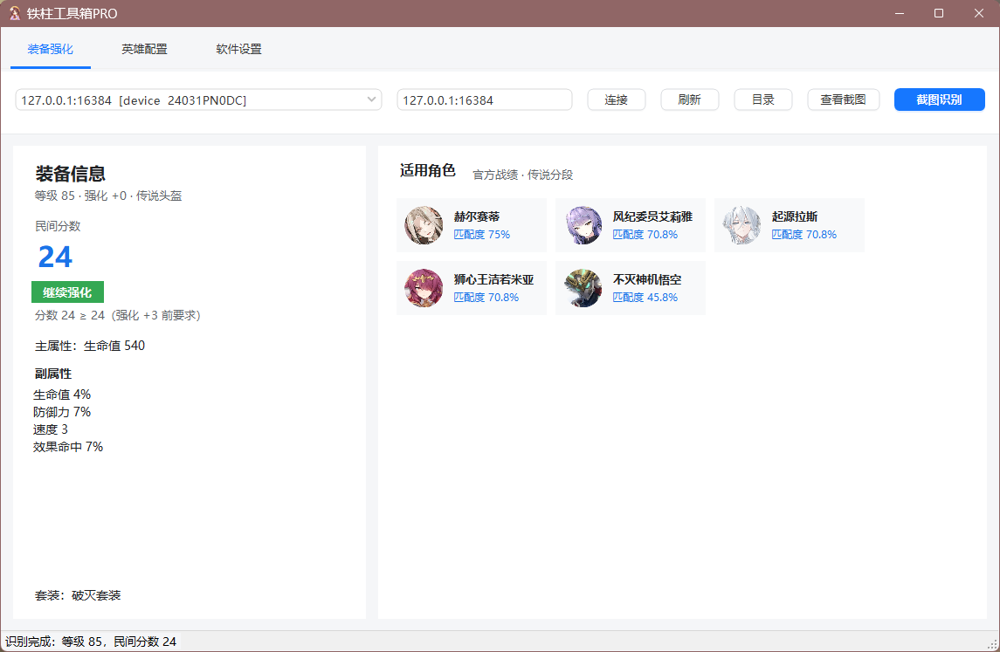
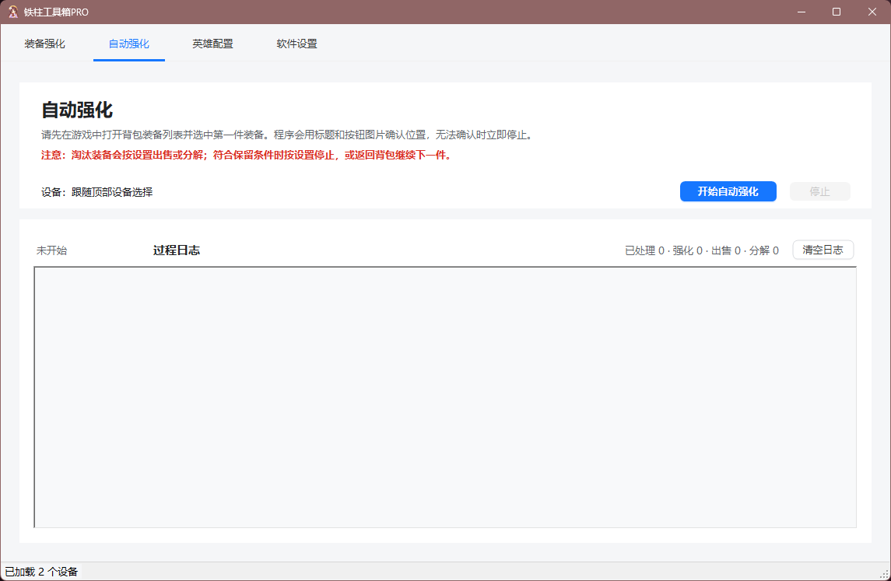
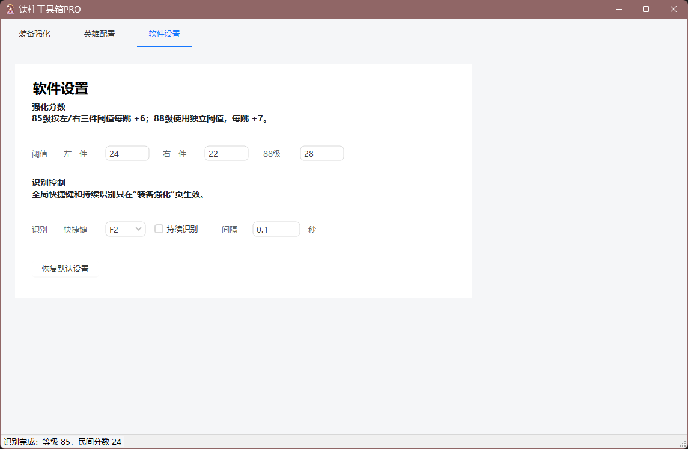

# 铁柱工具箱PRO

一款面向《第七史诗》的 Windows 装备强化辅助工具。通过 ADB 连接安卓模拟器并截取游戏画面，使用本地 OCR 自动识别装备信息、计算民间分数、给出强化建议，并按人工维护的套装属性需求推荐装备用途。

[下载最新版](https://github.com/Mooooooon/TiezhuToolboxPRO/releases/latest)

## 主要功能

- 自动识别装备等级、强化等级、品质、主属性、副属性和套装
- 根据副属性计算民间分数，并按装备等级和强化阶段给出强化建议
- 支持按强化建议自动强化装备，并按设置保留、出售或分解装备
- 新增“装备扫描”：无需 Python/Npcap/Wireshark 和远程解析服务，使用 Windows 自带 pktmon 在本机扫描装备与英雄配装并导出 Fribbels 兼容的 `gear.txt`
- 新增“星之铁匠铺”自动变更，可设置 1～4 条目标副属性和最低值，命中全部条件后自动停止
- 按“套装 → 属性子类 → 英雄配装组合”推荐装备用途，支持不同流派使用独立属性权重
- 右三主属性按85→90预估及88/90满值量化，速度鞋、暴击项链等自然参与需求匹配
- 内置只读需求分析页，可查看每个套装的属性组合、权重和适用英雄配装
- 支持速度套必须带速度、暴击率/暴伤高权重项链仅接受对应主属性等可关闭的强化规则
- 支持自定义强化阈值、最低需求匹配度、单次自动处理上限、识别快捷键和持续识别间隔
- 内置精简版 ADB，无需额外安装 .NET 运行环境

## 界面预览

### 装备强化

连接模拟器后，可一键截图识别装备，并查看分数、强化建议和适用角色。



### 自动强化

在游戏中打开英雄装备列表并选中第一件装备后，程序会通过截图确认当前界面和按钮位置，自动识别装备、执行分阶段强化，并依据强化建议保留或淘汰装备。可设置淘汰时出售或分解、单次处理上限，以及遇到符合保留条件的装备后停止或继续下一件。

> 自动强化会消耗游戏资源，并可能出售或分解装备。启动前请核对强化阈值、处理方式和单次上限。



### 装备扫描

关闭游戏后在“装备扫描”页开始扫描，允许一次管理员授权，再启动第七史诗并进入大厅；如需扫描仓库装备，请在停止前打开装备仓库一次。英雄可选择全部导出、至少 5 星且 5 觉醒，或仅 6 星 6 觉醒；停止后可导出与 Fribbels 原版自动导入器相同结构的 `gear.txt`。

> 抓包由 Windows 10/11 自带的 Packet Monitor 完成，不安装 Python 或抓包驱动。TCP 重组、游戏传输层解码、LZ4 解压、MessagePack 读取和 `gear.txt` 转换全部在本机完成，不会上传游戏数据；解析结束后默认删除原始抓包。

导出格式以 [Fribbels Epic 7 Optimizer](https://github.com/fribbels/Fribbels-Epic-7-Optimizer) 的自动导入器为兼容目标。游戏协议变化后可能需要更新本工具；尚未收录的活动装备会按不可重铸的 88 级装备修复，主属性使用其他 +15 88 级装备的固定档位，并在扫描日志中显示修复数量。

### 星之铁匠铺

在游戏中打开星之铁匠铺的副能力值变更页面后，可设置一至四条目标属性和最低值。程序会识别右侧四条候选副属性，未全部达标时自动点击“变更副能力值”，命中目标、达到次数上限或无法确认界面时停止。

> 自动变更会消耗游戏内持有点数。启动前请核对目标条件和最多变更次数，并在停止后自行确认游戏画面。

### 需求分析

按套装查看人工维护的属性子类、聚合权重、需求量及英雄完整配装组合。

### 软件设置

可调整装备分数阈值、自动强化处理方式与上限、最低需求匹配度、速度套/暴击项链特殊规则、全局识别快捷键和持续识别间隔。



## 使用方法

1. 从 [Releases](https://github.com/Mooooooon/TiezhuToolboxPRO/releases/latest) 下载最新版 ZIP 并完整解压。
2. 在安卓模拟器中开启 ADB 调试。MuMu 12 的默认地址为 `127.0.0.1:16384`。
3. 启动 `铁柱工具箱PRO.exe`，选择已发现的设备；如果没有发现设备，输入 ADB 地址后点击“连接”。
4. 在游戏中进入需要分析的装备的强化页面，然后点击“截图识别”或按默认快捷键 `F2`。
5. 在“装备强化”页查看装备分数、强化建议、适用属性子类及英雄配装。
6. 如需自动强化，先在“软件设置”中确认处理方式和上限，再进入游戏英雄装备列表、选中第一件装备，然后在“自动强化”页启动任务。
7. 如需自动变更副属性，进入游戏星之铁匠铺的副能力值变更页面，在“星之铁匠铺”页设置目标和次数上限后启动。
8. 如需导出 Fribbels 数据，关闭游戏后进入“装备扫描”页，按页面步骤完成本地扫描和导出。

## 使用要求

- Windows 10/11 64 位系统
- 支持 ADB 的安卓设备或模拟器
- 游戏使用简体中文界面

## 识别说明

- OCR 在本机运行，识别效果会受到游戏分辨率、界面缩放和截图清晰度影响。
- 当前强化建议主要针对 85 级和 88 级装备，并分别使用独立阈值。
- 需求推荐只匹配装备当前套装；匹配度同时考虑目标属性覆盖和分数向高权重属性的分配质量。
- 85级右三按未来90级满值估算，88/90使用同一满值档；主属性不加入装备分数和强化阶梯。
- 推荐结果仅供配装和强化决策参考，具体取舍仍应结合账号阵容。

## 装备强化判断免责声明

- 本工具提供的装备分数、强化建议和需求推荐基于民间算法、人工维护数据及用户设置的阈值，并非《第七史诗》官方结论，仅供参考。
- OCR 识别结果可能受到游戏版本、分辨率、界面缩放和画面质量等因素影响，请在强化前自行核对装备数据。
- 装备强化结果具有随机性，本工具无法保证实际强化结果或装备收益。因使用本工具建议而产生的游戏资源消耗、装备损失或其他后果，由使用者自行承担。

## 从源码构建

需要安装 [.NET 9 SDK](https://dotnet.microsoft.com/download/dotnet/9.0)。

```powershell
dotnet build src/TiezhuToolbox/TiezhuToolbox.csproj
dotnet publish src/TiezhuToolbox -c Release
```

## 免费软件声明

本软件为免费软件，作者及官方发布渠道不会收取任何软件购买费或授权费。请仅通过本项目的 [GitHub Releases](https://github.com/Mooooooon/TiezhuToolboxPRO/releases/latest) 获取正式版本。

如果您在任何平台或渠道为获取本软件本体支付了费用，该收费并非本项目官方行为，请及时联系卖家或付款平台申请退款，并注意防范第三方修改、捆绑或植入恶意程序的版本。

## 开源许可

本项目采用 [MIT License](LICENSE) 开源。
